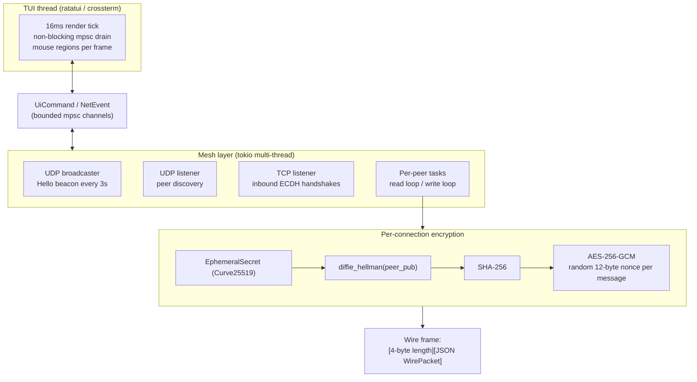

<div align="center">


*Built for CTF teams, red teams, air-gapped labs — fast encrypted comms with no internet required.*


<a href="#install">
  
</a>

<sub>📜 <a href="#what-it-is">About</a> · <a href="#what-actually-works-no-phantom-features">Features</a> · <a href="#install">Install</a> · <a href="#commands">Commands</a> · <a href="#keyboard-reference">Keys</a> · <a href="#architecture">Architecture</a> · <a href="#security-properties">Security</a></sub>

</div>

---

## What it is

mshwisper is a terminal mesh chat tool that works entirely on your **local network** — no internet, no servers, no config files. Launch it on every machine, enter a nickname, and you're live. Every message is encrypted before it touches the wire.

```
┌─────────────────────────────────────────────────────────────────────┐
│ ◆ mshwisper  MESH:ONLINE  2 peers              ghost (you) [F1:help]│
├───────────────┬─────────────────────────────────┬───────────────────┤
│ CHANNELS      │ #general                        │ ARSENAL           │
│               │                                 │                   │
│ ▶ #general    │  10:42 ghost  yo team      · ·  │  ghost  10:42     │
│ ○ #recon  (1) │  10:42 viper  sup, ready  ✓✓    │  $ nmap -sV 10…  │
│ ⬡ #ops-group  │  10:43 viper  ╭─ cmd [viper]    │                   │
│               │               │  $ nmap -sV …   │ TRANSFERS         │
│ OPERATORS     │               ╰─────             │                   │
│               │  10:44 ghost  file offer  ✓      │ ▼ loot.zip        │
│ ◆ ghost (you) │                                  │ ████░░░░░  42%    │
│ ● viper       │                                  │                   │
├───────────────┴─────────────────────────────────┴───────────────────┤
│ F1:help  PgUp/Dn:channel  ↑↓:scroll  /join /cmd /group  Ctrl+X:KILL │
├─────────────────────────────────────────────────────────────────────┤
│ INPUT  Type a message, or /join  /cmd  /group  /gateway  /help      │
└─────────────────────────────────────────────────────────────────────┘
```

---

## What actually works (no phantom features)

| Feature | Status |
|---|---|
| UDP broadcast peer discovery | ✅ Live |
| ECDH Curve25519 + AES-256-GCM encryption | ✅ Live |
| Decentralized mesh (no server) | ✅ Live |
| Multi-channel chat (`/join`) | ✅ Live |
| Private groups with join-request flow (`/group`, `/request`) | ✅ Live |
| Command broadcast to team (`/cmd`) — shown in Arsenal | ✅ Live (text broadcast only, does NOT execute anything) |
| Chunked file transfer (`/mshsend`) | ✅ Live |
| File offer popup with Y/N accept | ✅ Live |
| Files saved to `~/Downloads/` | ✅ Live |
| Message delivery ticks (· ✓ ✓✓) | ✅ Live |
| Mouse interaction (click channels, accept/deny, scroll) | ✅ Live |
| Message history navigation (↑/↓) | ✅ Live |
| Full line editing (Ctrl+K/U/V/W, word-move) | ✅ Live |
| Subnet gateway bridging (`/gateway`) | ✅ TCP connect (routing bridge is a stub) |
| RAM-only, zero disk writes | ✅ Live |
| Secure wipe on `/quit` and `Ctrl+X` | ✅ Live |
| Cross-platform: Linux, Windows, Android Termux | ✅ Live |

> **Note on `/cmd`:** It broadcasts the text of a command to all peers so the team sees it in the Arsenal column. It does **not** execute shell commands on remote machines. That would be a backdoor, not a feature.

> **Note on `/gateway`:** Establishes a TCP connection to the target address and marks this node as a gateway. Full packet-level routing between two isolated subnets is not yet implemented.

<div align="right"><a href="#mshwisper">↑ back to top</a></div>

---

## Install

<details open>
<summary><b>🐧 Linux / Kali (Bash or Zsh)</b></summary>

```bash
# Install Rust
curl --proto '=https' --tlsv1.2 -sSf https://sh.rustup.rs | sh
source "$HOME/.cargo/env"

# Clone and build
git clone https://github.com/rithinkrishnakv/mshwisper.git
cd mshwisper
cargo build --release
strip target/release/mshwisper

./target/release/mshwisper
```

> **Kali/Zsh note:** use `source "$HOME/.cargo/env"` (not `~/.cargo/env`) — Zsh can reject the tilde shortcut with `source`.

</details>

<details>
<summary><b>🪟 Windows CMD / PowerShell / Windows Terminal</b></summary>

```powershell
# Install Rust from https://rustup.rs (download and run rustup-init.exe)

git clone https://github.com/rithinkrishnakv/mshwisper.git
cd mshwisper
cargo build --release
.\target\release\mshwisper.exe
```

> Use **Windows Terminal** for best color and UTF-8 support. Classic `cmd.exe` works but looks less crisp.

</details>

<details>
<summary><b>🤖 Android / Termux</b></summary>

```bash
pkg update && pkg install rust openssl git

git clone https://github.com/rithinkrishnakv/mshwisper.git
cd mshwisper
cargo build --release

./target/release/mshwisper
```

> mshwisper uses directed subnet broadcast (`192.168.x.255`) rather than `255.255.255.255` — this works around Android's kernel-level broadcast restriction so Termux peer discovery works natively.

</details>

<div align="right"><a href="#mshwisper">↑ back to top</a></div>

---

## Commands & Keyboard reference

<table>
<tr>
<td valign="top" width="55%">

### Commands

| Command | What it does |
|---|---|
| `/join <name>` | Join or create an open channel |
| `/group <name>` | Create a **private group** — announced to mesh, join-by-request only |
| `/request <#group> <owner_id>` | Send a join request to the group owner |
| `/approve <#group> <requester_id>` | Approve a join request (group owner only) |
| `/deny <#group> <requester_id>` | Deny a join request |
| `/requests` | Toggle the join-requests popup |
| `/mshsend <peer_nick> <path>` | Send a file to a specific peer |
| `/cmd <text>` | Broadcast a command string to the whole team (Arsenal column) |
| `/gateway <ip:port>` | Connect to a gateway node on another subnet |
| `/help` | Toggle help overlay (also F1) |
| `/quit` | Graceful exit — wipes all session data from RAM |

</td>
<td valign="top" width="45%">

### Keyboard

| Key | Action |
|---|---|
| `Enter` | Send message |
| `↑ / ↓` | Browse history / scroll feed |
| `Ctrl+↑ / Ctrl+↓` | Scroll feed 1 line |
| `PgUp / PgDn` | Switch channel |
| `F1` | Toggle help |
| `Ctrl+Left / Right` | Move cursor by word |
| `Ctrl+Backspace` / `Ctrl+W` | Delete previous word |
| `Ctrl+K` | Cut to end of line |
| `Ctrl+U` | Cut to start of line |
| `Ctrl+V` | Paste (yank) |
| `Ctrl+A` / `Home` | Jump to line start |
| `Ctrl+E` / `End` | Jump to line end |
| `Ctrl+X` | **Kill switch** — wipes keys + RAM, blanks screen, exits instantly |

</td>
</tr>
</table>

### Mouse

- **Click a channel** in the sidebar to switch to it
- **Scroll wheel** scrolls the message feed
- **Click `[↑][↓]`** in the feed title bar to scroll
- **Click `[Y] Accept` / `[N] Reject`** on file offer popups
- **Click `[A] Approve` / `[D] Deny`** on join request popups
- **Click anywhere** on the help overlay to close it

<div align="right"><a href="#mshwisper">↑ back to top</a></div>

---

## Message ticks

Own messages show delivery status in the bottom-right corner:

| Symbol | Meaning |
|---|---|
| `·` | Sending (no peers connected yet) |
| `✓` | Sent to at least one peer |
| `✓✓` | Delivered — peer acknowledged receipt |

---

## Private groups

```
# Create a group (you become the owner)
/group #ops

# Other peers see it announced. They request to join:
/request #ops <your_node_id>      # node id shown at startup

# You see a popup (or red badge in titlebar). Approve or deny:
/approve #ops <their_node_id>     # or click [A] in the popup
/deny    #ops <their_node_id>     # or click [D]
```

Open channels (`/join`) are free for anyone on the mesh. Private groups (`/group`) require owner approval.

<div align="right"><a href="#mshwisper">↑ back to top</a></div>

---

## Architecture

```
TUI thread (ratatui / crossterm)
  16 ms render tick · non-blocking mpsc drain · mouse regions tracked per frame
         │
         │  UiCommand / NetEvent  (bounded mpsc channels)
         │
Mesh layer (tokio multi-thread)
  UDP broadcaster  — Hello beacon every 3 s
  UDP listener     — peer discovery
  TCP listener     — inbound ECDH handshakes
  Per-peer tasks   — read loop / write loop (one pair per peer)

Per-connection encryption:
  EphemeralSecret (Curve25519)
    └─ diffie_hellman(peer_pub)
         └─ SHA-256
              └─ AES-256-GCM   (random 12-byte nonce per message)

Wire frame:
  [ 4-byte big-endian length ] [ JSON WirePacket ]
```

<details>
<summary><b>📊 Same flow, as a diagram</b></summary>



</details>

### Ports

| Port | Protocol | Purpose |
|---|---|---|
| 47800 | UDP | Peer discovery broadcast |
| 47801 | TCP | Encrypted peer sessions |

<div align="right"><a href="#mshwisper">↑ back to top</a></div>

---

## Security properties

- All wire traffic is AES-256-GCM encrypted after handshake
- Keys are ephemeral per session — forward secrecy
- Zero disk writes — nothing survives process exit
- `/quit` and `Ctrl+X` both explicitly overwrite input/yank buffers and call `wipe()` on all state before exit
- **No peer identity verification** — any node on the LAN that speaks the protocol can join. Add a shared passphrase layer on top for hostile environments (planned)

---

## License

MIT — see [LICENSE](LICENSE).

---

<div align="center">

<sub>Rust · ratatui · tokio · x25519-dalek · aes-gcm · crossterm</sub>


</div>